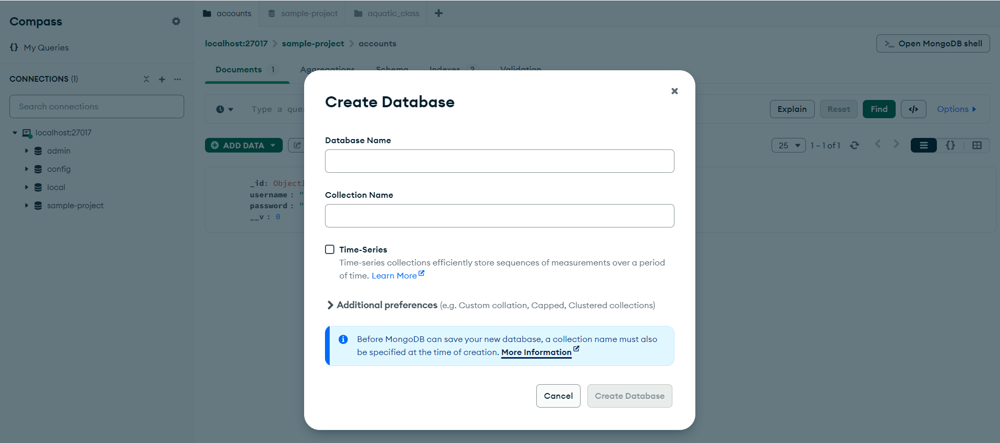
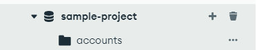
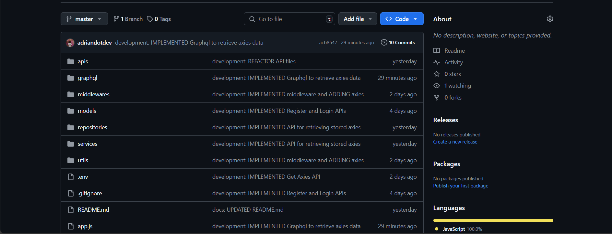
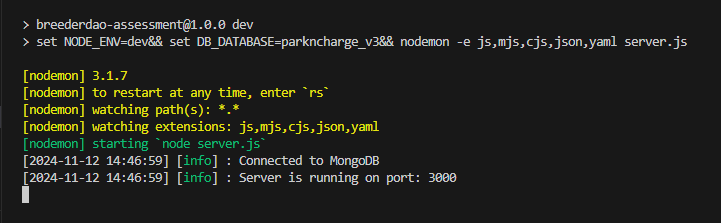

## Prerequisites

Ensure the following are installed and set up on your machine:

- Git.
- Node installed on your machine.
- MongoDB

## Database Setup

### Database Setup in Localhost

1. Ensure MongoDB Compass is installed on your machine.

   For Windows: Here's the download link: https://downloads.mongodb.com/compass/mongodb-compass-1.44.6-win32-x64.exe

   For Mac: Here's the download link: https://downloads.mongodb.com/compass/mongodb-compass-1.44.6-darwin-x64.dmg

2. Once successfully installed, open MongoDB Compass and create a new database. You can name it whatever you like, and create your first collection.

   

3. After successfully creating a new database, you will see this on the sidebar

   

## Running the project

1. Clone this repository: https://github.com/adriandotdev/breederdao-assessment.

   

2. After successfully cloning the repository, navigate to the new created folder.

   ```bash
   cd /breederdao-assessment
   ```

3. Install dependencies.

   ```bash
   npm install
   ```

4. After successfully installing all the dependencies, run the app.

   ```bash
   npm run dev
   ```

5. Once you successfully setup the database and the app, you will see this in the console.

   

## Technologies Used

- NodeJS
- ExpressJS
- GraphQL
- MongoDB
